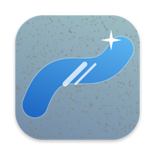

<p align="center"></p>

<h1 align="center">Camsil</h1>

<p align="center">
  <a href="https://github.com/ahmetkorkmaz3/camsil/releases/latest"></a>
  <a href="https://github.com/ahmetkorkmaz3/camsil/actions/workflows/ci.yml"></a>
  
  
  <a href="LICENSE"></a>
</p>

<p align="center"><a href="https://ahmetkorkmaz3.github.io/camsil/">Website</a> · <a href="#install">Install</a> · <a href="#use">Use</a> · <a href="CONTRIBUTING.md">Contributing</a></p>

Your screen is a dirty window. Spray it, wipe it, make it shine.

Camsil shows your main screen as a dusty glass pane. Spray water with the bottle, then wipe the wet glass with the cloth. When the glass is 95% clean, it shines and Camsil closes.

## Install

Run this command in Terminal:

```sh
curl -fsSL https://raw.githubusercontent.com/ahmetkorkmaz3/camsil/main/install.sh | sh
```

The command downloads the latest release, checks the SHA-256 value, and installs the app in `/Applications`. Requirements: a Mac with Apple Silicon (M1 or later) and macOS 14 or later.

**Update:** Run the same command again.

**A specific version:** `curl -fsSL https://raw.githubusercontent.com/ahmetkorkmaz3/camsil/main/install.sh | CAMSIL_VERSION=1.0.0 sh`

**Manual install:**

1. Download the `Camsil-X.Y.Z.zip` file from the [Releases](https://github.com/ahmetkorkmaz3/camsil/releases) page.
2. Open the zip file. Move `Camsil.app` into `/Applications`.
3. Open the app. macOS shows the "Apple could not verify" warning. Click **Done**.
4. Open System Settings → Privacy & Security. At the bottom of the page, click **Open Anyway**.

The app is not notarized, so a file from the browser shows this warning. The install command does not show this warning.

**Uninstall:**

```sh
osascript -e 'quit app "Camsil"'
rm -rf /Applications/Camsil.app
tccutil reset ScreenCapture com.ahmetkorkmaz.Camsil
```

## Use

1. Open Camsil. On the first start, give the Screen Recording permission. Then open Camsil again.
2. Left click: spray. Right click or Space: change between the bottle and the cloth. The 1 and 2 keys also select a tool.
3. Wipe wet glass with the cloth. Dry wiping only spreads the dust.
4. Esc or Cmd+Q closes Camsil at any time. Camsil also closes after 2 minutes without input.

**Screen Recording:** Camsil reads the screen image to draw the glass over it. The image stays in memory on the GPU. Camsil does not save it and does not send it anywhere. Camsil does not use the network.

If macOS asks for Screen Recording again after an update, reset the entry and open Camsil again:

```sh
tccutil reset ScreenCapture com.ahmetkorkmaz.Camsil
```

## Contributing

Build, tests, project structure, and pull request rules: [CONTRIBUTING.md](CONTRIBUTING.md). Release steps: [`docs/release.md`](docs/release.md). Sound credits: [CREDITS.md](CREDITS.md).

## License

MIT. See [LICENSE](LICENSE).
